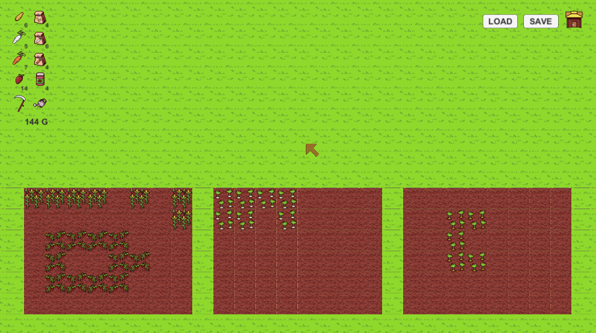
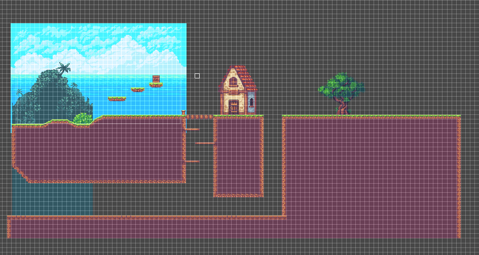

# 220720_2D

유니티 무료 애셋을 이용하여 간단한 게임 구현

- [1_Farming 프로젝트](#1_farming-프로젝트)
- [2_Sunnyland 프로젝트](#2_sunnyland-프로젝트)
 
 

## 기술 스택

| Unity | C# |
| :--------: | :--------: |
|      |       |

 

## 1_Farming 프로젝트

#### 1) 프로젝트 개요

###### 유니티 무료 애셋인 [Basic Pixel Farm Asset Pack](https://assetstore.unity.com/packages/2d/characters/basic-pixel-farm-asset-pack-64192)을 사용하여 간단한 농사 게임 구현

#### 2) 작업 일지

| 날짜 | 항목 | 상세 |
| :---: | :---: | :---: |
| 220720 | 애셋 뜯어보기 | Basic Pixel Farm 애셋 뜯어보고 리소스 활용 방법 생각하기 |
| 220720 | 맵 구성 | Layer Sorting 고려하여 타일맵 사용 |
| 220720 | CLICK/MOUSE_OVER 이벤트 스크립트 작성 및 적용 | 아이콘 배치, MOUSE_OVER 이벤트를 위한 PointerEventsController 클래스 작성 |
| 220721 | 마우스 커서 변경 | 마우스 커서 변경을 위한 텍스처 준비&적용 |
| 220721 | 씨앗 심기 | TileMapEvent 클래스 작성, TileMap 좌표 변환 |
| 220721 | 작물 성장 | 작물 프리팹 제작, GrowingCrops 클래스 작성, delegate 적용, CropManager 클래스 작성 |
| 220721 | 아이템 데이터화 및 수치 연동 | 아이템 데이터 관리를 위한 DataManager 클래스 작성, 수치와 UI 연동 |
| 220721 | 골드 재화 추가 | 골드 재화 추가 및 DataDefine 클래스 정리 |
| 220725 | 작물 수확 | 작물 수확 기능 구현 후 DataManger, UI와 연동 |
| 220725 | 물 주기 | 물주기 기능 추가 |
| 220725 | 상점(구매, 판매) 기능 | ScrollView를 사용하여 ShopPanel 구현, 아이템의 정보를 파밍하여 ShopItem을 ShopwPanel의 요소로 생성, 구매, 판매 상호작용, 제약사항 구현 |
| 220726 | 현재 진행상황 저장 | 저장해야 할 데이터, 저장 방식 고려, 클래스 또는 Generic Collection의 직렬화 방식 고려 |
| 220728 | 저장된 정보 불러와서 이어하기 | 저장된 json 파일 파싱하여 DataManager, CropManager, UI와 연동, 기타 절차에 따라 생기는 버그들 수정 |
| 220728 | 물 주기2 | 물을 줬는지 확인하는 변수와 루틴 추가, 작물 수확 시 여부에 따라 확률 변동, 저장 데이터 추가 & 구현 |

 
 

## 2_Sunnyland 프로젝트

#### 1) 프로젝트 개요

###### 유니티 무료 애셋인 [Sunny land](https://assetstore.unity.com/packages/2d/characters/sunny-land-103349)를 사용하여 간단한 2D 플랫폼 게임 구현

 

#### 2) 작업 일지

| 날짜 | 항목 | 상세 |
| :---: | :---: | :---: |
| 220802 | 애셋 뜯어보기 | Sunny land 애셋 뜯어보고 리소스 활용 방법 생각하기, 간단한 맵 구상 |
